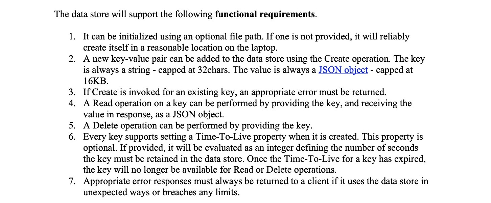
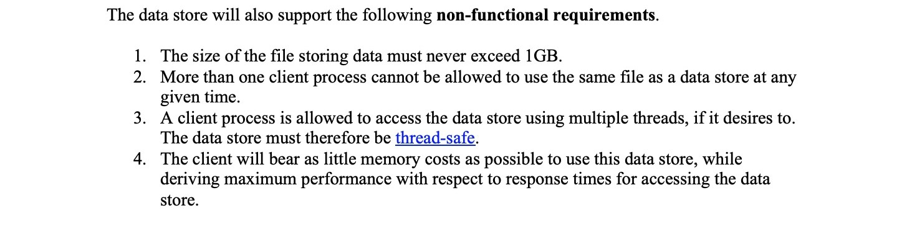

# Assignment-Project
DataStore - Assignment Project For Graduate Trainee 
<div align="center" width="250px" height="400px">
    
 </div>
 
 
 # Installation
 Clone this and ``` cd ``` to the desired directory
 ```
   $ git clone https://github.com/rahulnarayananl/Assignment-Project/
   $ cd Assignment Project
 ```
 
 # Accessing Datastore
 
- A class named DataStore in the file Assingment-Project/Datastore contains all the CRD operations.
- Create a Class instance importing DataStore
- An instance of Class DataStore [DataStore_Instance].create(\<key>,\<json-value-data>, (optional) \<datastore directory>) can be used to create a data in DataStore.
- A instance of Class DataStore [DataStore_Instance].read(\<key>) can be used to read a data from the DataStore.
- An instance of Class DataStore [DataStore_Instance].delete(\<key>) can be used to delete a data from the DataStore.
 
 
# Environment Setup

- Operating system: Windows and Ubuntu
- Python: Python3.6 or higher

# Test Setup
 To run tests, run the following command
``` 
python3 test.py
```

 
# Implemented:

- Implemented functional requirements and fully commented.
- Implemented non functional requirements.
- Implemented user defined Exceptions
- Unit tested thoroughly

# Tested:
- Unit tested instance creation with path and optional path
- Unit tested create API with DataStore instance for all the functional requirements and non funcional requirments
- Unit tested read API with DataStore instance for all the functional requirements and non funcional requirments
- Unit tested delete API with DataStore instance for all the functional requirements and non funcional requirments
- Unit tested timeToLive Property with create, read and delete APIs
- Unit tested JSON value size for large Json values


# The data store will support the following functional requirements.

 
 <div align="center" width="250px" height="400px">
    
 </div>
  
 
# The data store will support the following non Functional Requirments:


 <div align="center" width="250px" height="400px">
    
</div>


